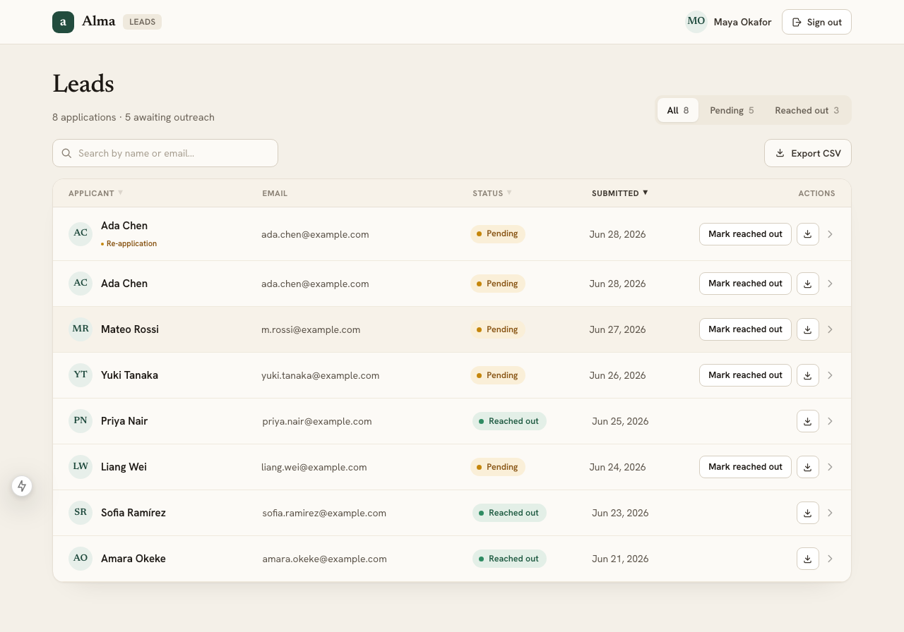
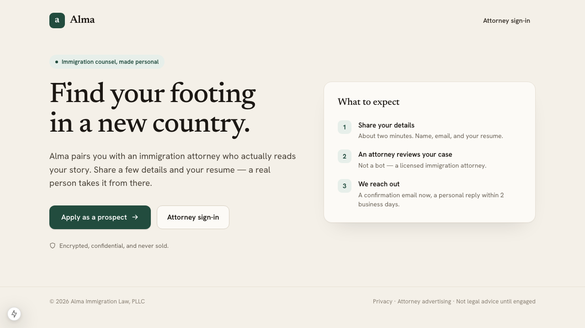
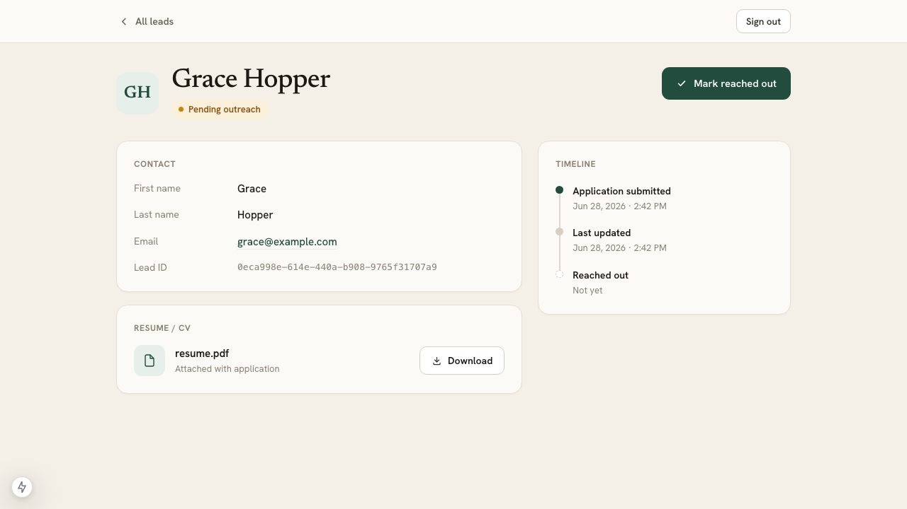

# Alma — Lead Management System

A publicly accessible lead-intake form that emails both the prospect and a company attorney on
submission, plus an auth-gated internal dashboard where attorneys review leads, read resumes, and
move them through a `PENDING → REACHED_OUT` workflow.



## Features

**Public intake**
- Lead form (first name, last name, email, resume) with client + server validation
- Resume upload to S3-compatible object storage; magic-byte type checking + size limits
- On submit: confirmation email to the prospect **and** a notification to the attorney
- Per-IP rate limiting (anti-spam)

**Attorney dashboard** (auth-gated)
- All leads with search, sortable columns, and status filters
- One-click **Mark reached out** — reversible (undo back to pending) — with a re-application (duplicate-email) flag
- **Soft delete** (archives a lead; the row and resume are retained, never hard-destroyed)
- Lead detail with an **inline PDF preview**, private attorney notes, a status timeline, and resume download
- **CSV export** of the current view
- Account sign-up + sign-in (Better Auth) with brute-force protection

## Tech stack

| Layer | Choice |
|---|---|
| API | **FastAPI** · SQLAlchemy 2.0 · Alembic · PostgreSQL |
| Web | **Next.js** (App Router) · TypeScript · Tailwind v4 |
| Auth | **Better Auth** — issues EdDSA JWTs; FastAPI verifies them via JWKS |
| Storage | S3-compatible (MinIO local / Supabase hosted) via boto3 |
| Email | SMTP → Mailpit (local) / Resend (hosted), behind one pluggable client |
| Dev | Docker Compose — one command brings up the whole stack |

## Quick start

```bash
cp .env.example .env
make up      # build + start db, storage, mail, backend, frontend
make seed    # migrations + storage bucket + attorney account
make demo    # (optional) load a realistic set of sample leads + resumes
```

| URL | What |
|---|---|
| http://localhost:3000 | Web app |
| http://localhost:8000/docs | FastAPI interactive API docs |
| http://localhost:8025 | Mailpit — the emails sent on each submission |

**Attorney login:** `maya.okafor@alma.law` / `almademo2026`

## Screens

| Public intake | Lead detail |
|---|---|
|  |  |

## Testing

```bash
make test            # backend (pytest, 35) + frontend (vitest, 20)
```

## Documentation
- [`docs/DESIGN.md`](docs/DESIGN.md) — system design & rationale
- [`docs/RUNNING.md`](docs/RUNNING.md) — detailed local run guide
- [`docs/DEPLOYMENT.md`](docs/DEPLOYMENT.md) — free hosting (stretch)
- [`docs/agent-usage/`](docs/agent-usage/) — coding-agent usage writeup, prompt logs, attribution
